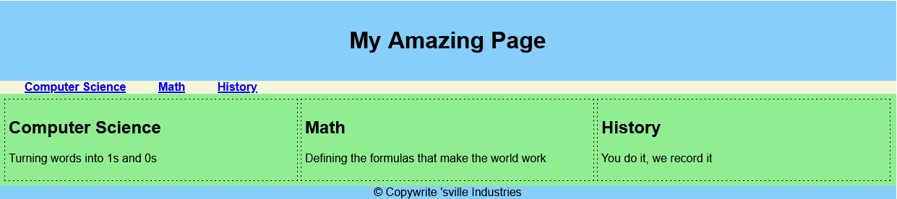
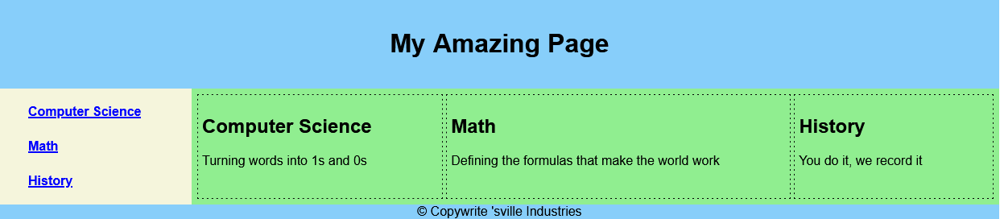

# Practice Lab

We are going to build CSS files that utilize Float and Flexbox features to layout a web page.  The HTML of the web page will remain the same but the CSS will be used to modify the layout.

## Float

## Flexbox

## Flexbox with Navigation on Left

